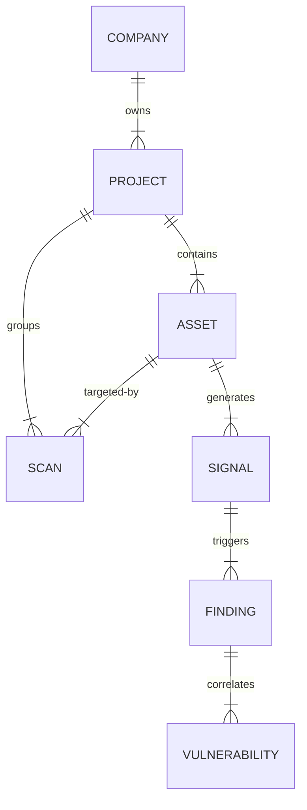
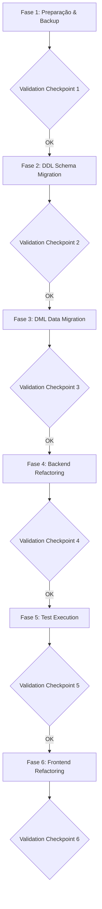

# Plano de Migração Arquitetural — Mouse IA

Este plano descreve a estratégia de engenharia, o mapeamento de banco de dados, os arquivos afetados, a compatibilidade de dados e os riscos associados para realizar a transição do modelo legado da entidade **`Site`** para o novo modelo de domínio composto por **`Project`** (Contêiner Operacional) e **`Asset`** (Recurso Técnico Monitorado). 

Essa reestruturação baseia-se na validação semântica e na necessidade de alinhar a plataforma com os princípios definidos na arquitetura corporativa descrita em [ARCHITECTURE.md](file:///Users/hmjfotografia/MouseIA/docs/ARCHITECTURE.md) e na decisão de design [ADR-014 (Separação de Containers Operacionais e Recursos Monitorados)](file:///Users/hmjfotografia/MouseIA/docs/DECISIONS.md#L648-L726).

---

## 1. Objetivo da Migração

O principal objetivo desta migração é eliminar a entidade legada `Site` e substituí-la pela separação clara de responsabilidades:
*   **Contexto Operacional (`Project`):** Atuar exclusivamente como um agrupador lógico no nível de organização (tenant) para controle administrativo, sem reter detalhes físicos de varredura.
*   **Recurso Tecnológico (`Asset`):** Atuar como a entidade física que representa a superfície de ataque monitorada (URL, IP, Domínio, repositório, etc.).

Dessa forma, o Mouse IA deixa de ter uma limitação estrutural de "um Site por projeto" e passa a suportar múltiplos ativos (`Assets`) de diferentes naturezas sob um mesmo projeto operacional (`Project`), abrindo caminho para capacidades reais de Attack Surface Management (ASM).

---

## 2. Estado Atual Identificado

### Validação Semântica (Discovering Data Structure)
A validação semântica realizada na base de dados e no código revelou que o modelo **`Site`** ([site.py](file:///Users/hmjfotografia/MouseIA/backend/app/models/site.py)) acumulava duas responsabilidades distintas (responsabilidade híbrida dupla):
1.  **Como Contêiner Operacional (Agrupador):** Serve como o nó intermediário do multi-tenancy. Agrupa logicamente ativos (`assets`), varreduras (`scans`) e sinais (`signals`) vinculando-os a uma organização via `company_id`.
2.  **Como Alvo Físico (Recurso Monitorado):** Armazena o campo `url`, lido diretamente pela engine de scans para acionar scanners técnicos.

### Análise dos Dados Legados Reais
A inspeção da base de dados local ativa (`backend/data/mouseia.db`) revelou os seguintes registros de sites que serão afetados pela transformação:

| ID | Nome (site.name) | URL (site.url) | Empresa (site.company_id) |
| :--- | :--- | :--- | :--- |
| `1` | HMJ Fotografia | `https://hmjfotografia.com/` | `1` |
| `2` | Lagoinha São Luis | `https://lagoinhasaoluis.com/` | `2` |
| `3` | DSO Concursos | `https://dsoconcursos.com.br/` | `3` |

Historicamente, as tabelas `scans`, `signals` e outras dependem desse `site_id` para correlação técnica e rastreamento histórico.

---

## 3. Estado Alvo da Arquitetura

O modelo final de domínio adota a seguinte estrutura relacional limpa:



### Principais Alterações de Fluxo
*   **`Project`** substitui completamente o papel organizacional do `Site`. Ele pertence a uma `Company` (ou `Organization`) e possui apenas dados conceituais (`name`, `description`).
*   **`Asset`** recebe a URL do site antigo. O `Asset` pertence a um `Project`.
*   **`Scan`** é modificado para possuir `project_id` (contexto) e `asset_id` (alvo técnico).
*   **`Signal`** remove o campo `site_id` e aponta diretamente para `asset_id`.

---

## 4. Mapeamento de Entidades

A transição das tabelas de banco de dados e dos atributos correspondentes no SQLite e PostgreSQL será mapeada conforme a tabela a seguir:

| Entidade/Tabela Atual | Nova Entidade/Tabela | Ação e Mapeamento de Atributos |
| :--- | :--- | :--- |
| **`sites`** | **`projects`** | **Renomear Tabela:** `sites` ➔ `projects`. <br>• Manter `id` (chave primária) para preservar o histórico.<br>• Mapear `name` ➔ `name`.<br>• Mapear `description` ➔ `description`.<br>• Mapear `company_id` ➔ `company_id` (FK para `companies`).<br>• Descartar coluna `url` após migrá-la para `assets`. |
| — | **`assets`** | **Nova Inserção:** Criar novos registros em `assets` a partir da tabela `sites`.<br>• `name` ➔ `[site.name] - Web Application`.<br>• `asset_type` ➔ `'web_application'`.<br>• `value` ➔ `site.url`.<br>• `project_id` ➔ `site.id` (agora referenciando `projects.id`).<br>• `is_active` ➔ `True`. |
| **`scans`** | **`scans`** | **Modificar Colunas:** <br>• Renomear FK `site_id` ➔ `project_id` (chave estrangeira para `projects.id`).<br>• Preencher FK `asset_id` (chave estrangeira para `assets.id`) com a ID do ativo gerado a partir do site correspondente. |
| **`signals`** | **`signals`** | **Modificar Colunas:**<br>• Remover FK `site_id`.<br>• Adicionar FK `asset_id` (chave estrangeira para `assets.id`) apontando para o ativo gerado a partir do site original. |
| **`vulnerabilities`** | **`vulnerabilities`** | **Sem alteração estrutural:** Mantém o relacionamento direto com `asset_id`. A migração de dados garante que a associação original de vulnerabilidades seja preservada ao redirecionar as chaves. |

---

## 5. Estratégia de Migração de Dados

A migração de dados será realizada via script Python e migração do Alembic, focando na **preservação do histórico e consistência referencial** sem perda de dados.

### 5.1 Mecânica de Preservação de IDs e Histórico
Para evitar órfãos em históricos operacionais (Scans, Signals, Findings e Vulnerabilidades), os IDs primários de `sites` serão atribuídos diretamente como IDs primários de `projects` (`sites.id` = `projects.id`). 

```text
Passo 1: sites (ID: 1) ───────────> projects (ID: 1)
Passo 2: sites (ID: 1, url: 'X') ─> assets (ID: N, project_id: 1, value: 'X')
Passo 3: scans (site_id: 1) ──────> scans (project_id: 1, asset_id: N)
Passo 4: signals (site_id: 1) ────> signals (asset_id: N)
```

### 5.2 Scripts Conceituais de Transformação (DML)
A lógica de migração executará as seguintes operações SQL (ou comandos SQLAlchemy equivalentes):

```sql
-- 1. Inserir todos os sites existentes na nova tabela de projetos preservando as PKs
INSERT INTO projects (id, name, description, company_id, created_at, updated_at)
SELECT id, name, description, company_id, created_at, updated_at FROM sites;

-- 2. Gerar um ativo técnico do tipo 'web_application' para cada projeto baseado na URL original
INSERT INTO assets (name, asset_type, value, description, is_active, company_id, project_id, created_at, updated_at)
SELECT name || ' - Web Application', 'web_application', url, 'Ativo gerado na migração do Site original', 1, company_id, id, created_at, updated_at 
FROM sites;

-- 3. Atualizar a tabela de scans ligando-a ao novo project_id e ao asset correspondente
-- (Assumindo SQLite/PostgreSQL com subqueries para mapear o asset correto)
UPDATE scans
SET project_id = site_id,
    asset_id = (SELECT id FROM assets WHERE assets.project_id = scans.site_id AND assets.asset_type = 'web_application' LIMIT 1)
WHERE site_id IS NOT NULL;

-- 4. Atualizar a tabela de signals associando-a diretamente ao asset correspondente
UPDATE signals
SET asset_id = (SELECT id FROM assets WHERE assets.project_id = signals.site_id AND assets.asset_type = 'web_application' LIMIT 1)
WHERE site_id IS NOT NULL;
```

---

## 6. Ordem de Execução (Fases da Migração)

A migração é dividida em **6 fases bem-definidas**, cada uma precedida e sucedida por checkpoints de validação técnica para mitigar riscos de quebras.



### Fase 1: Preparação e Backup
1.  Paralisar o agendador de scans temporariamente para evitar gravações concorrentes.
2.  Gerar backup físico do banco de dados SQLite (`backend/data/mouseia.db`) ou snapshot lógico do PostgreSQL.
3.  **Checkpoint 1:** Validar integridade e tamanho do backup (e.g., hash MD5).

### Fase 2: Execução de DDL (Alembic)
1.  Criar a tabela `projects` com a estrutura idêntica à tabela `sites` (exceto coluna `url`).
2.  Adicionar coluna `project_id` em `scans` (chave estrangeira).
3.  Adicionar coluna `asset_id` em `signals` (chave estrangeira).
4.  **Checkpoint 2:** Confirmar integridade física do novo esquema gerado pelo Alembic (`alembic upgrade head`).

### Fase 3: Migração de Dados (DML)
1.  Executar script de migração de dados (DML) preenchendo as tabelas `projects` e `assets` e remapeando FKs in `scans` e `signals`.
2.  Remover a tabela física legada `sites` e colunas legadas obsoletas (`scans.site_id`, `signals.site_id`).
3.  **Checkpoint 3:** Rodar query de auditoria cruzando contagens:
    *   `Count(projects) == Count(sites_legados)`
    *   `Count(assets_web_app) == Count(sites_legados)`
    *   Confirmar que não há registros órfãos nas tabelas filhas (`scans.project_id IS NULL` ou `signals.asset_id IS NULL`).

### Fase 4: Refatoração do Backend (Código)
1.  Ajustar modelos SQLAlchemy, schemas Pydantic, serviços e controllers de API para usar os novos caminhos `/projects` e `/assets`.
2.  **Checkpoint 4:** Iniciar a API e efetuar chamadas manuais nos novos endpoints `/projects` e `/assets` (deve retornar `200 OK` com dados corretos).

### Fase 5: Atualização e Execução da Suíte de Testes
1.  Renomear arquivos de testes e payloads para usar o novo modelo de domínio.
2.  **Checkpoint 5:** Executar `pytest` em ambiente local e confirmar **100% de testes passando**.

### Fase 6: Refatoração do Frontend
1.  Modificar chamadas HTTP, nome de views e menus do frontend React para refletir as novas rotas.
2.  **Checkpoint 6:** Validar renderização do Dashboard principal e das páginas de escopo no navegador.

---

## 7. Arquivos Afetados

A tabela abaixo lista todos os arquivos da aplicação que deverão ser atualizados nas fases subsequentes da migração:

### 7.1 Backend (Banco de Dados e Modelos)
*   [backend/app/models/site.py](file:///Users/hmjfotografia/MouseIA/backend/app/models/site.py) ➔ Renomear para `project.py` (Definir classe `Project`).
*   [backend/app/models/asset.py](file:///Users/hmjfotografia/MouseIA/backend/app/models/asset.py) ➔ Remover relacionamento com `Site`, incluir FK obrigatória para `Project`.
*   [backend/app/models/scan.py](file:///Users/hmjfotografia/MouseIA/backend/app/models/scan.py) ➔ Substituir `site_id` por `project_id`.
*   [backend/app/models/signal.py](file:///Users/hmjfotografia/MouseIA/backend/app/models/signal.py) ➔ Substituir `site_id` por `asset_id`.
*   [backend/app/models/__init__.py](file:///Users/hmjfotografia/MouseIA/backend/app/models/__init__.py) ➔ Atualizar exportação do modelo `Project` e remover `Site`.

### 7.2 Backend (Schemas, Repositories, Services e APIs)
*   [backend/app/schemas/site.py](file:///Users/hmjfotografia/MouseIA/backend/app/schemas/site.py) ➔ Renomear para `project.py` (`ProjectCreate`, `ProjectOut`, `ProjectUpdate`).
*   [backend/app/repositories/site_repository.py](file:///Users/hmjfotografia/MouseIA/backend/app/repositories/site_repository.py) ➔ Renomear para `project_repository.py`.
*   [backend/app/services/site_service.py](file:///Users/hmjfotografia/MouseIA/backend/app/services/site_service.py) ➔ Renomear para `project_service.py`.
*   [backend/app/api/sites.py](file:///Users/hmjfotografia/MouseIA/backend/app/api/sites.py) ➔ Renomear para `projects.py` (Mapear endpoints para `/projects`).
*   [backend/app/main.py](file:///Users/hmjfotografia/MouseIA/backend/app/main.py) ➔ Atualizar importações e registros de rotas de API.

### 7.3 Frontend (React)
*   [frontend/src/services/api.js](file:///Users/hmjfotografia/MouseIA/frontend/src/services/api.js) ➔ Atualizar caminhos de endpoints de `/sites` para `/projects` e `/assets`.
*   [frontend/src/components/Sites.jsx](file:///Users/hmjfotografia/MouseIA/frontend/src/components/Sites.jsx) ➔ Renomear para `Projects.jsx` (Redesenhar layout para listar Projetos e seus ativos integrados).
*   [frontend/src/App.jsx](file:///Users/hmjfotografia/MouseIA/frontend/src/App.jsx) ➔ Modificar navegação e rótulos de abas de "Sites" para "Projetos".

### 7.4 Testes Automatizados
*   [backend/tests/test_sites.py](file:///Users/hmjfotografia/MouseIA/backend/tests/test_sites.py) ➔ Renomear para `test_projects.py`.
*   [backend/tests/test_sites_auth.py](file:///Users/hmjfotografia/MouseIA/backend/tests/test_sites_auth.py) ➔ Renomear para `test_projects_auth.py`.

---

## 8. Estratégia de Testes

Os testes automatizados e validações de integridade serão a barreira de segurança contra regressões.

### 8.1 Teste de Migração do Alembic
Antes de atualizar a produção, a migração será testada localmente em um banco de dados SQLite separado (`temp_test.db`):
```bash
# Executar a migração de schema e dados em base temporária
alembic -c backend/alembic.ini upgrade head
```
Serão executados scripts SQL que garantem que todos os dados históricos continuam legíveis após o upgrade.

### 8.2 Atualização da Suíte de Testes do Backend
*   **Contratos de API:** Os testes de integração (como `test_projects.py`) validarão que o payload de criação de um `Project` não aceita mais uma `url` no primeiro nível, mas aceita parâmetros corporativos padrão.
*   **Testes de Criação de Assets:** Inclusão de testes validando que a inserção de novos ativos exige um ID de projeto ativo e válido.
*   **Execução Geral:** O pipeline local de qualidade (`pytest`) deverá ser executado para comprovar a estabilidade do ecossistema backend.

---

## 9. Estratégia de Rollback

Caso ocorra alguma falha crítica durante uma das fases da migração, os seguintes passos de rollback deverão ser executados imediatamente:

### 9.1 Rollback na Fase 2 (DDL) ou Fase 3 (DML)
1.  **Ação:** Interromper a migração.
2.  **Passo Alembic:** Rodar o comando de downgrade para a revisão anterior:
    ```bash
    alembic downgrade [revision_anterior]
    ```
3.  **Restauração Física (Fallback):** Substituir o arquivo de banco corrompido `mouseia.db` pelo backup gerado na Fase 1 (`mouseia.db.bak`).
4.  **Validação:** Reiniciar o servidor da API e rodar a suíte de testes legado para confirmar o retorno do estado consistente anterior.

### 9.2 Rollback na Fase 4 (Backend) ou Fase 5 (Testes)
1.  **Ação:** Descartar as alterações de código locais.
2.  **Comando Git:** Reverter o repositório para o commit estável anterior:
    ```bash
    git reset --hard HEAD
    git clean -fd
    ```
3.  **Validação:** Executar `pytest` para certificar que o backend legível está 100% operacional.

---

## 10. Critérios de Sucesso

A migração arquitetural será considerada concluída com sucesso quando atender aos seguintes critérios:
1.  **Estrutura de Domínio Limpa:** A entidade `Site` deve estar totalmente ausente do código-fonte e do banco de dados físico.
2.  **Zero Perda de Dados:** Os 3 sites cadastrados originais devem constar como 3 projetos funcionais, com suas URLs corretas mapeadas em 3 novos registros na tabela `assets` correspondente.
3.  **Preservação Histórica Completa:** Todos os scans históricos, sinais e descobertas devem estar vinculados perfeitamente aos projetos e ativos gerados.
4.  **Suíte de Testes Automatizados 100% Verde:** Todos os testes no backend refatorado executam e passam sem erros.
5.  **Interface Gráfica Atualizada:** O frontend renderiza a aba "Projetos" e permite gerenciar escopo operacional e visualizar ativos com sucesso.

---

## 11. Riscos Adicionais de Domínio Identificados

Durante a modelagem da transformação, foram mapeados os seguintes riscos de negócio/tecnologia:

1.  **Limitações do SQLite para Migrações Batch:**
    *   *Risco:* **Alto**
    *   *Descrição:* O SQLite não dá suporte nativo a remoção de chaves estrangeiras ou modificação de constraints em tabelas existentes (`ALTER TABLE DROP CONSTRAINT`). O Alembic simula isso copiando tabelas inteiras (`render_as_batch=True`). Se houver dados inconsistentes na base de dados (e.g. `scans` apontando para `site_id` inválido), o Alembic travará.
    *   *Mitigação:* Criar um script pré-migração que limpa chaves estrangeiras órfãs do SQLite antes de disparar o DDL.
2.  **Duplicidade de Assets:**
    *   *Risco:* **Médio**
    *   *Descrição:* A criação automática do ativo `"HMJ Fotografia - Web Application"` a partir do site original pode gerar conflitos se o usuário já tiver cadastrado manualmente um ativo idêntico na tabela `assets`.
    *   *Mitigação:* O script de migração de dados usará cláusulas `INSERT OR IGNORE` baseadas na combinação única de `project_id` e `value` do ativo.
3.  **Latência Operacional na Migração DML:**
    *   *Risco:* **Baixo**
    *   *Descrição:* Em bases de dados de produção maiores, realizar a subquery de remapeamento para milhares de sinais e scans pode causar contenção de banco.
    *   *Mitigação:* Criar índices temporários nas colunas de remapeamento durante a execução da migração, removendo-os ao final do processo.
